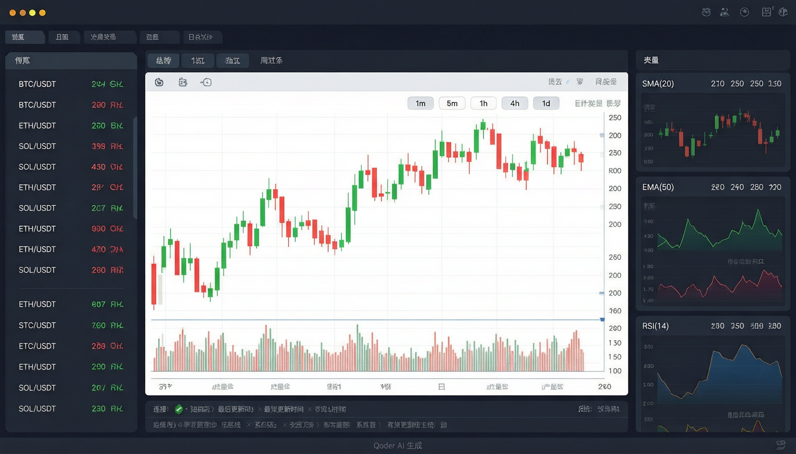
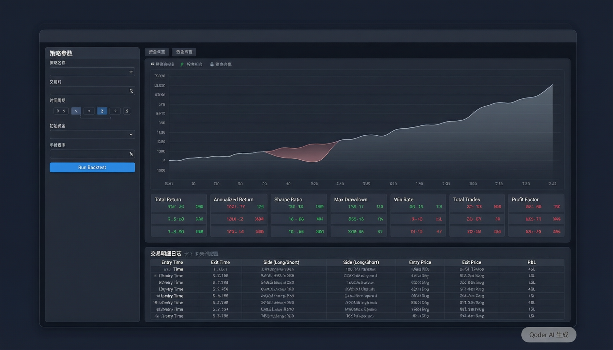

# RustQuant — Rust 桌面量化交易系统

## 1. 项目概述

面向 Rust 初学者的量化交易学习项目，构建行情展示 + 技术指标 + 实时行情 + 策略回测系统，补全 GUI 编程、数据可视化、实时通信、金融计算等前序项目未覆盖的核心技能。

**学习衔接：** myapp（CLI 基础）→ rustkv（并发/异步/高级 trait）→ RustQuant（GUI / 可视化 / 实时 / 回测 / 金融计算）

**核心价值：**
- 补全 GUI 编程能力（egui 桌面应用，填补前序项目纯 CLI 的空白）
- 深入异步 Rust（tokio + reqwest 并发请求 + tungstenite WebSocket）
- 了解量化交易基础（K 线、技术指标、实时行情、策略回测）
- 实践数据可视化（自绘 K 线图、指标曲线、实时价格闪烁）

**技术栈：** egui + eframe (GUI) | tokio + reqwest (异步/HTTP) | tungstenite (WebSocket) | polars (数据) | serde (序列化) | anyhow + thiserror (错误)

## 2. 目标用户

Rust 初学者（项目所有者），前端背景，已完成 myapp + rustkv，对量化交易有兴趣。

## 3. 功能需求

### 3.1 P0 核心功能（Phase 1-3 交付）

- **F1 历史 K 线获取**：Binance REST API，多交易对、多周期（1m~1d），本地缓存
  - 验收：缓存命中不重复请求；网络异常有友好提示
- **F2 技术指标**：自行实现 SMA/EMA/RSI/MACD/布林带，抽象为 Indicator trait
  - 验收：与 TradingView 误差 < 0.01%；新增指标只需实现 trait
- **F3 主界面仪表盘**：egui 桌面，品种列表 + K 线图 + 指标面板 + 状态栏
  - 验收：品种/周期流畅切换；有 loading 态；状态栏显示连接状态
- **F4 K 线图渲染**：egui Shape API 自绘 Candlestick，缩放/平移，叠加指标曲线 + 成交量
  - 验收：红绿蜡烛正确；交互流畅无卡顿

### 3.2 P1 增强功能（Phase 4-5 交付）

- **F5 实时行情推送**：Binance WebSocket 接入，订阅多交易对实时 K 线 + Ticker
  - 验收：WebSocket 连接稳定，断线自动重连；延迟 < 500ms
- **F6 实时 UI 更新**：行情看板实时刷新，价格闪烁（涨绿跌红），实时 K 线追加
  - 验收：价格变动即时反映；K 线图自动滚动到最新
- **F7 回测引擎**：向量化回测 + 手续费/滑点模拟 + 统计报告
  - 验收：统计指标（夏普/回撤/胜率）正确；支持自定义策略接入
- **F8 回测报告**：收益曲线图 + 统计指标表格 + 交易记录列表
  - 验收：收益曲线可交互；交易记录可导出

### 3.3 P2 扩展功能（Phase 6 交付）

- **F9 交易策略框架**：`Strategy` trait 抽象，输入 K 线 + 指标，输出 Buy/Sell/Hold，参数可配
  - 验收：实现 trait 即可接入回测引擎；参数面板可动态配置
- **F10 内置策略**：均线交叉（金叉/死叉）+ RSI 超买超卖
  - 验收：两个策略均可在回测引擎运行；参数可调
- **F11 模拟交易**：Paper Trading，持仓跟踪 + 账户余额 + 盈亏计算
  - 验收：模拟账户记录完整；支持手动下单/平仓
- **F12 数据导出**：CSV 导出 K 线 / 回测结果 / 交易记录
  - 验收：Excel 可直接打开；字段完整无遗漏

### 3.4 阶段交付物

**Phase 1 — 数据层**

- `quant-data` crate：封装 Binance REST API 客户端，支持多交易对（BTCUSDT/ETHUSDT 等）和多周期（1m/5m/15m/1h/4h/1d）
- 本地缓存模块：JSON 文件存储，按 `{symbol}/{interval}.json` 组织，重复请求直接读缓存
- CLI 工具：`cargo run -- fetch --symbol BTCUSDT --interval 1h --limit 500`，终端打印 K 线表格
- 单元测试：mock HTTP 响应，验证数据解析和缓存命中逻辑

**Phase 2 — 指标层**

- 指标库 crate：输入 K 线序列输出各指标时间序列
- Indicator trait 抽象：`fn calculate(klines: &[Kline]) -> Vec<IndicatorOutput>`
- 单元测试：与 TradingView 数据交叉验证，误差 < 0.01%

**Phase 3 — 界面层**

- egui 桌面应用：主界面仪表盘（品种列表 + K 线图 + 指标面板 + 状态栏）
- 自绘 K 线图：Shape API Candlestick，支持缩放/平移/指标叠加
- 品种/周期切换流畅，有 loading 态

**Phase 4 — 实时层**

- WebSocket 客户端：Binance WebSocket 接入，订阅实时 K 线 + Ticker 推送
- 实时 UI 更新：行情看板实时刷新、价格闪烁（涨绿跌红）、K 线自动追加
- 断线重连机制：网络异常自动重连，状态栏显示连接状态
- 与现有数据层融合：历史 K 线 + 实时 K 线无缝衔接

**Phase 5 — 回测层**

- 向量化回测引擎：基于 polars，支持手续费/滑点模拟
- 回测报告：收益曲线图 + 统计指标（夏普比率/最大回撤/胜率/盈亏比）+ 交易记录表格
- 策略参数配置面板：在 UI 中选择策略、调整参数、一键回测

**Phase 6 — 策略层**

- Strategy trait 框架：`fn on_kline(&mut self, kline: &Kline, indicators: &IndicatorStore) -> Signal`
- 内置策略：均线交叉（金叉/死叉）+ RSI 超买超卖
- 模拟交易（Paper Trading）：持仓跟踪 + 账户余额 + 盈亏计算
- CSV 导出：K 线数据 / 回测结果 / 交易记录一键导出

## 4. 数据模型

```rust
// K 线 (OHLCV)
Kline {
    open_time, close_time: u64,    // 开盘/收盘时间 (Unix ms)
    interval: Interval,            // M1/M5/M15/H1/H4/D1
    open, high, low, close: f64,   // OHLC 价格
    volume, quote_volume: f64,     // 成交量 / 成交额
    symbol: String,
}

// 实时 Ticker（WebSocket 推送）
Ticker {
    symbol: String,
    price: f64,                    // 最新价
    price_change_pct: f64,         // 24h 涨跌幅
    volume_24h: f64,               // 24h 成交量
    high_24h, low_24h: f64,        // 24h 最高/最低
    update_time: u64,              // 更新时间 (Unix ms)
}

// WebSocket K 线推送
WsKline {
    symbol: String,
    interval: Interval,
    open, high, low, close: f64,
    volume: f64,
    is_closed: bool,               // K 线是否已闭合
    close_time: u64,
}

// 指标体系
enum IndicatorName { SMA, EMA, RSI, MACD, BollingerBands }
Indicator { name: IndicatorName, params: Vec<(&str, f64)> }
// SMA→[("period",20)]  MACD→[("fast",12),("slow",26),("signal",9)]
enum IndicatorOutput {
    Single(f64),                   // SMA/EMA/RSI → 单值
    Multi(HashMap<String, f64>),   // MACD→dif/dea/hist, BB→upper/middle/lower
}

// 回测
BacktestConfig { symbol, interval, start_time, end_time, initial_capital, commission_rate, slippage }
BacktestResult {
    total_return, annualized_return, benchmark_return,  // 收益
    sharpe_ratio, max_drawdown, volatility,              // 风险
    win_rate, profit_loss_ratio,                         // 交易统计
    trades: Vec<TradeRecord>, equity_curve: Vec<(u64, f64)>,
}
TradeRecord { side: Signal, entry_price, exit_price, quantity, pnl, commission, open_time, close_time }

// 策略
enum Signal { Buy, Sell, Hold }
trait Strategy {
    fn name(&self) -> &str;
    fn on_kline(&mut self, kline: &Kline, indicators: &IndicatorStore) -> Signal;
}
```

## 5. 非功能需求

| 类别 | 要求 |
|------|------|
| 性能 | K 线图 1000 根 > 30fps；指标计算 10000 条 < 100ms |
| 实时性 | WebSocket 行情延迟 < 500ms；UI 刷新帧率 > 30fps |
| 错误处理 | 返回 Result，不 panic；UI 层捕获展示；WebSocket 断线自动重连 |
| 准确性 | 指标与 TradingView 误差 < 0.01% |
| 跨平台 | Windows / macOS / Linux |

## 6. UI 原型

### 6.1 主界面原型



左侧品种列表（BTC/ETH 等，显示实时价格 + 24h 涨跌幅）+ 中央 K 线图（支持缩放/平移/指标叠加）+ 右侧指标面板（MA/RSI/MACD 参数配置 + 数值展示）+ 底部状态栏（连接状态 + 最新更新时间）。

### 6.2 回测报告界面



策略参数配置区（策略选择 + 参数滑块）+ 收益曲线图（策略 vs 基准对比）+ 统计指标表格（夏普/回撤/胜率/盈亏比）+ 交易记录列表（买卖时间/价格/盈亏）。

## 7. 学习目标映射

| 功能模块 | Rust 特性 | myapp | rustkv |
|---------|----------|-------|--------|
| REST API | reqwest + async/await | ❌ | ✅ |
| 技术指标 | Iterator + 泛型 + 数值计算 | ❌ | ❌ |
| egui 界面 | GUI + 事件驱动 + 自绘 | ❌ | ❌ |
| WebSocket 实时数据 | tungstenite + 异步流 + 并发状态 | ❌ | ❌ |
| 回测引擎 | polars + 向量化计算 | ❌ | ❌ |
| 策略模式 | trait 抽象 + 泛型 + 动态分发 | ❌ | ❌ |
| 数据导出 | CSV + 文件 IO | ❌ | ✅ |
| 金融计算 | f64 精度 + 数值稳定性 | ❌ | ❌ |

**新补强：** GUI 编程、数据可视化、WebSocket 实时通信、策略回测、金融计算

## 8. 约束与假设

- 需访问 Binance REST API + WebSocket（可能需代理）；仅公开行情数据，不涉及真实交易
- 单用户桌面，数据量上限 ~10000 根 K 线/交易对/周期
- 指标自行实现（学习目的），不依赖第三方库
- WebSocket 连接为只读订阅，不发送交易指令
